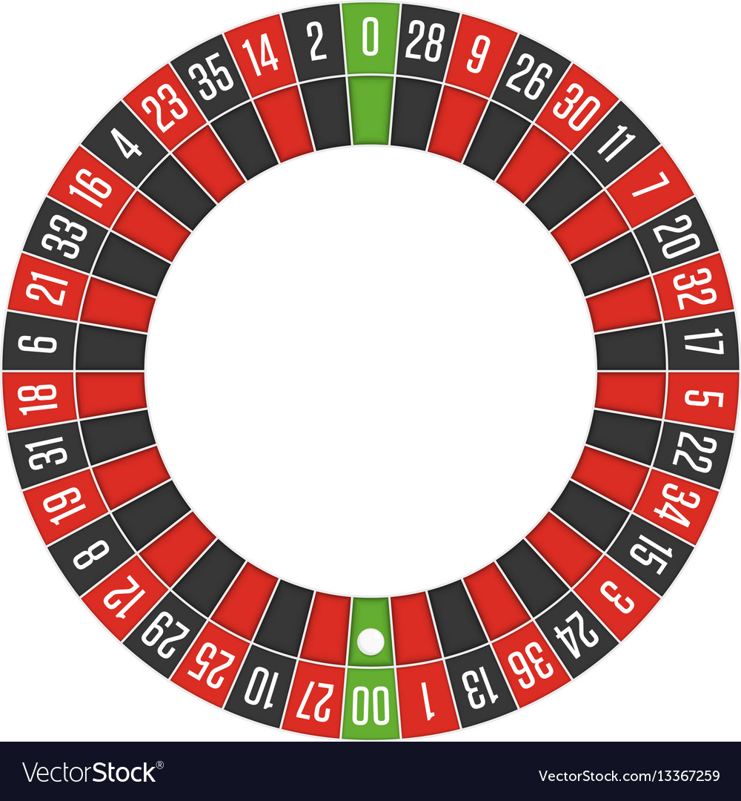

# О wheel 
- Эмулирует математическую модель "рулетки"

# Пояснения

## Параметры
- money - деньги на вашем счету 
- stage - количество сделанных ходов
- bet   - значение ячейки выбранной игроком
- value - значение выпавшей ячейки
- index - номер выпавшей ячейки

## Организация взаимодействия с игрой
- Инициация игры `<name> = wheel.fortuna()` 
- После инициализации предполагается производить ставки посредством методов освещённых в следующем разделе
- Когда у игрока кончатся деньги на счету методы начнут возвращать "Error". Это означает что ваша игра окончена и можно фиксировать результаты

## Вариатны ставок
- bet = ячейка которую вы выбрали
- money = сумма которую вы поставили
- `bet_in_num(bet, money)`      - ставка на число
    - x35
- `bet_in_split(bet, money)`    - ставка на два числа
    - x17
- `bet_in_care(bet, money)`     - ставка на три числа
    - x8
- `bet_in_color(bet, money)`    - ставка на цвет
    - Принимает 1 (нечет) или 2 (чёт)
    - x2
- `bet_in_half(bet, money)`     - ставка на половину поля
    - Принимает 0 (1-18) и 1 (19-36)
    - x1
- `bet_in_zero(money)`          - ставка на zero
    - x40

## Поле сделано по следующей схеме
